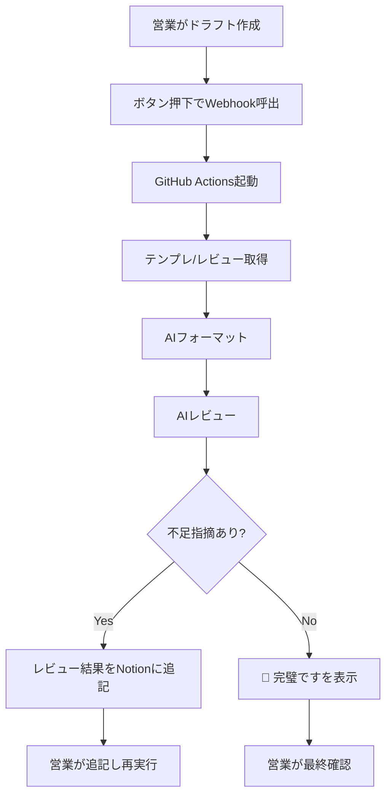

# 要件定義テンプレート（高品質サンプル）

_Notionページにコピーして利用してください。数値や根拠、決定者を明記し、未定事項は `{TBD: 内容}` 形式で記入します。_

## 0. プロジェクト概要
| 項目 | 記入ガイド | 入力 |
| --- | --- | --- |
| プロジェクト名 | サービス/プロダクト名 |  |
| 作成日 | YYYYMMDD（ユーザー確認済み） |  |
| 作成者 / 役割 | 氏名・ポジション |  |
| 主要ステークホルダー | 関係者と役割（例: 営業MGR, 開発G, CS） |  |
| 背景（現状の課題） | 数値・頻度・影響額など定量根拠を含めて記載 |  |
| 目的（解決したい問題） | 課題と紐づく目的を明確化 |  |
| 成功指標 | 指標名 / 現状値 / 目標値 / 達成期限 |  |
| 完了条件 | 「何ができれば完了か」を一文で |  |

### 未確定事項（TBD）
| 項目 | 内容 | 決定者 | 判断材料 | 期限 (YYYYMMDD) |
| --- | --- | --- | --- | --- |
| {TBD: } |  |  |  |  |

---

## 1. 想定ユーザーと利用シーン
### 1.1 ペルソナ一覧
| ペルソナ名 | 役割 / 部門 | 課題・痛み | ITリテラシー | 成功の定義 |
| --- | --- | --- | --- | --- |
|  |  |  |  |  |

### 1.2 主要利用シナリオ
| シナリオ名 | いつ | どこで / 誰と | 何を見て | 操作フロー（ステップ） | 完了条件 |
| --- | --- | --- | --- | --- | --- |
|  |  |  |  |  |  |

---

## 2. 入出力と処理の流れ
### 2.1 入力情報
| フィールド名 | 種別 | 必須/任意 | 入力者 | 情報源 | 品質チェック |
| --- | --- | --- | --- | --- | --- |
|  |  |  |  |  |  |

### 2.2 出力イメージ
| 出力先 | 表示形式 | 更新単位 | 閲覧者 | 成功メッセージ |
| --- | --- | --- | --- | --- |
| Notionページ | Markdown（整形済みセクション） | 差し替え | 営業チーム | 🎉 完璧です（全項目記載済み） |

### 2.3 処理ステップ
| Step | 担当（手動/自動） | インプット | アウトプット | 成功条件 | エラー時の扱い |
| --- | --- | --- | --- | --- | --- |
| 1 | 営業（手動） | 初期ドラフト | Draftページ | 全セクション仮入力 | 不明点はTBD記載 |
| 2 | 自動 | Draftページ | 整形済みページ | テンプレ構造順守 | フォールバック：未更新メッセージ |
| 3 | 自動 | 整形済みページ | AIレビュー結果 | レビュー観点を網羅 | 再実行ガイド表示 |
| 4 | 営業（手動） | レビュー結果 | 更新済みページ | 指摘に対応完了 | 再実行 |

### 2.4 業務フロー（Mermaid）

### 2.5 完了判定
- 必須項目すべて埋まっている（欠損はTBD管理）
- レビュー結果で❌/⚠️が0件
- 🎉 完璧です が表示され、営業リーダーが確認済み

---

## 3. 解決したい問題 → 要件対応表
| 解決したい問題（定量根拠付き） | 実装で満たす要件 | 判定方法 / 指標 | 優先度 (H/M/L) | 担当 |
| --- | --- | --- | --- | --- |
| フォーマットが乱れている（例: 90%でズレ発生） | AI整形でテンプレ構造へ再配置 | テンプレ準拠率95%以上 | H |  |
| 情報が抜けている（例: エンジニア聞き取り週3h） | AIレビューで欠落指摘 | 指摘に基づく追記率90%以上 | H |  |
| 営業セルフレビューが困難 | レビュー結果の理解しやすさ | 営業セルフレビュー完了率80%以上 | M |  |

---

## 4. UX設計・設定方式
### 4.1 設定方法
- Notionボタン設定手順
- 必要なID（テンプレート / レビュー / 対象ページ）の取得方法
- GitHub Secrets登録手順（NOTION_API_KEY / OPENAI_API_KEY / NOTION_TEMPLATE_PAGE_ID / NOTION_REVIEW_PAGE_ID）

### 4.2 操作体験
- 1クリックで整形・レビューが走ること
- 実行中 / 完了 / エラー時のユーザー通知方法
- 誤操作防止策（例: 再実行ガイド、完了メッセージ）
- アクセシビリティ配慮（非エンジニアでも理解できる文言）

---

## 5. 導入手順
1. リポジトリ準備（テンプレートFork、アクセス権限設定）
2. Secrets設定（NOTION_API_KEY / OPENAI_API_KEY / NOTION_TEMPLATE_PAGE_ID / NOTION_REVIEW_PAGE_ID）
3. Notionページの作成（テンプレート / レビュー観点 / テスト用ページ）
4. Webhook（repository_dispatch）設定とテスト
5. ステージングでの試験実行と承認フロー

---

## 6. ツール・APIまとめ
| ツール/サービス | 用途 | 参照ドキュメント | 制約・上限 | 備考 |
| --- | --- | --- | --- | --- |
| Notion API | ページ取得・更新 | 公式Doc URL | レート制限/ブロック種別 | コメントAPI不可 |
| GitHub Actions | 自動実行 | 公式Doc URL | 実行時間/回数制限 | 要Secrets設定 |
| OpenAI API | フォーマット・レビュー | 公式Doc URL | トークン制限 | モデル: gpt-4o-mini |

---

## 7. 運用方法
| 項目 | 詳細 |
| --- | --- |
| 実行タイミング | 例: 営業がドラフト完成後に週1-2回 |
| モニタリング | GitHub Actionsログ / Slack通知など |
| エラー対応 | 再実行手順 / 連絡先 / サポート体制 |
| 定期メンテ | 月次APIキー確認 / テンプレ改訂レビュー |

---

## 8. エラー時の対応方針
| 想定エラー | 検知方法 | 自動対応 | 手動対応 / エスカレーション | 再発防止策 |
| --- | --- | --- | --- | --- |
| 認証エラー | Actions失敗ログ | Secrets再読込 | GitHub管理者へ連絡 | Secrets更新手順整備 |
| APIレート超過 | OpenAI/Notionレスポンス | バックオフ | 実行時間調整 | 実行間隔のガイド |

---

## 9. リスクと制約
| リスク/制約 | 発生確率 | 影響度 | 検知方法 | 回避/緩和策 |
| --- | --- | --- | --- | --- |
|  |  |  |  |  |

---

## 10. 改善サイクルとメトリクス
| 指標 | 測定方法 | 現状値 | 目標値 | 測定頻度 | 改善アクション |
| --- | --- | --- | --- | --- | --- |
| 要件テンプレ準拠率 | レビュー結果ログ |  |  |  |  |
| 営業セルフレビュー完了率 | ボタン実行後アンケート |  |  |  |  |

---

## AIレビュー結果
### ❌ 不足している項目
- 未入力

### ⚠️ 改善が必要な項目
- 未入力

### ✅ 適切に記載されている項目
- 未入力

### 🎉 完璧です
- すべての項目が適切に記載されたときのみ表示
